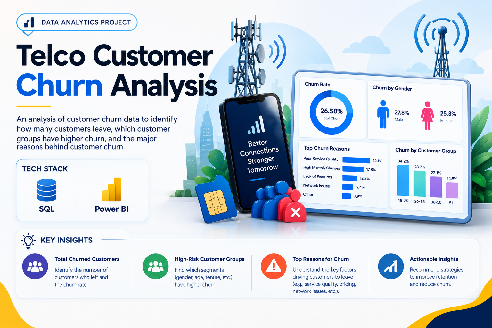
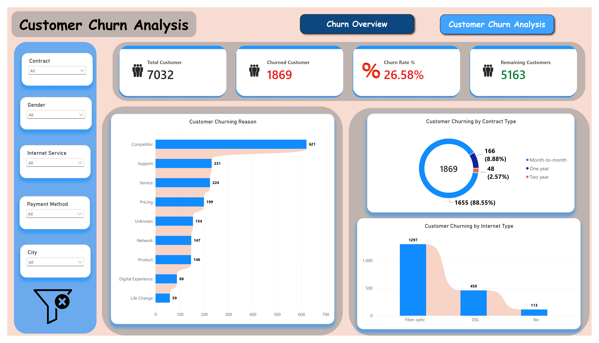
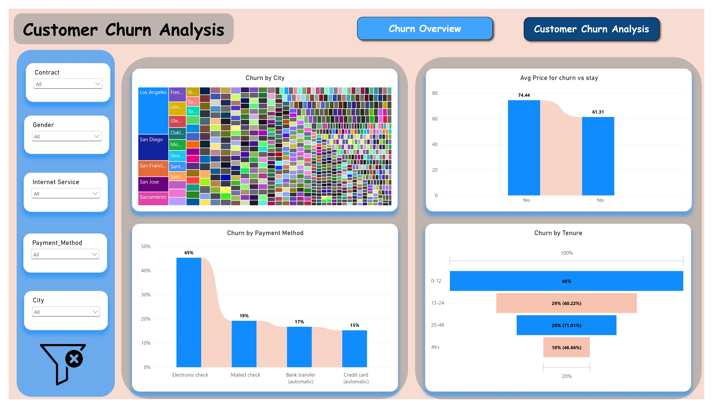

# Telco Customer Churn Analysis

<p align="center">
  
</p>

An analysis of customer churn data to identify **how many customers leave, which customer groups have higher churn, and the major reasons behind customer churn**.

---

## 📌 Main Business Question

> **Why are customers leaving the telecom company, which customer groups are more likely to churn, and what can the company do to improve customer retention?**

---

## 🎯 Business Questions

This project answers the following questions:

- How many customers have churned?
- What is the overall churn rate?
- Which customer groups have higher churn rates?
- Which contract types have higher churn?
- Which internet service types have higher churn?
- Which payment methods show higher churn?
- How does customer tenure relate to churn?
- What are the major reasons customers leave?
- Are monthly charges different between churned and retained customers?

---

## 🛠️ Tools & Technologies

- **MySQL**
- **SQL**
- **Power BI**

---

## 🔄 Project Workflow

### 1. Database & Table Creation

- Created a MySQL database named `Churn`
- Created the `telco_churn` table
- Defined appropriate data types for customer, service, contract, billing, and churn fields

### 2. Data Transformation

Created additional columns to support analysis.

#### Churn Reason Category

Grouped individual churn reasons into broader business categories:

- Competitor
- Service
- Pricing
- Network
- Product
- Digital Experience
- Life Change
- Unknown

#### Tenure Groups

Customers were grouped into:

- 0–12 months
- 13–24 months
- 25–48 months
- 49+ months

### 3. SQL Analysis

SQL was used to analyze:

- Overall customer churn
- Churn rate
- Gender
- Internet service
- Contract type
- Payment method
- Monthly charges
- Customer tenure
- Churn reasons

### 4. Power BI

The SQL analysis was used to create an interactive Power BI dashboard for communicating the key findings.

---

## 📊 Power BI Dashboard

<p align="center">
  
  
</p>

The dashboard focuses on:

- Customer churn
- Contract type
- Internet service
- Payment method
- Customer tenure
- Churn reasons

---

## 🔍 Key Findings

### Overall Churn

- **26.58%** of customers churned.
- **1,869 customers** were recorded as churned.

### Internet Service

- Fiber optic customers had a **41.89% churn rate**.
- DSL customers had a **19% churn rate**.

### Contract Type

- Month-to-month: **42.71% churn rate**
- One year: **11.28% churn rate**
- Two year: **2.85% churn rate**

### Payment Method

- Electronic Check customers had a **45.29% churn rate**, which was higher than other payment methods.

### Churn Reasons

- **33.23%** of churned customers had competitor-related reasons.
- **24.35%** of recorded churn reasons were related to support and service.
- Pricing-related issues also appeared among the recorded churn reasons.

### Customer Tenure

- Customers with **0–12 months of tenure** had the highest churn rate at **47.68%**.
- Customers with **49+ months of tenure** had the lowest churn rate at **9.51%**.

---

## 💡 Business Recommendations

### 1. Improve Early Customer Retention

A large share of churn comes from customers with shorter tenure. The company should strengthen onboarding, guidance, and support during the initial months.

### 2. Investigate Fiber Optic Customer Churn

Fiber optic customers show a higher observed churn rate than DSL customers. The company should investigate service quality, network reliability, speed, and customer expectations.

### 3. Encourage Longer-Term Contracts

Month-to-month customers have a much higher churn rate than customers on longer-term contracts. The company could explore incentives or additional benefits to encourage one-year or two-year contracts.

### 4. Address Competitor-Related Churn

Competitor-related reasons represent a major portion of recorded churn. The company should review competitor pricing, data allowances, internet speeds, and device offerings.

### 5. Improve Service and Support Experience

Support and service-related issues appear frequently among churn reasons. The company should investigate support quality, response times, and employee expertise.

### 6. Review Pricing and Additional Charges

Pricing-related reasons are present among churned customers. The company should review pricing structures, additional charges, and billing practices.

---

## 📂 Project Structure

```text
telco-customer-churn-analysis/
│
├── Dataset/
│   └── telco_churn.csv
│
├── SQL/
│   ├── Database_and_Table_Creation.sql
│   ├── Data_Transformation.sql
│   └── Churn_Analysis.sql
│
├── Documentation/
│   └── Telco_Customer_Churn_Analysis.pdf
│
├── images/
│   ├── telco-customer-churn-thumbnail.png
│   ├── telco-churn-dashboard_1.jpg
│   └── telco-churn-dashboard_2.jpg
│
├── Customer_Churn_Analysis_Dashboard.pdf
│
└── README.md
